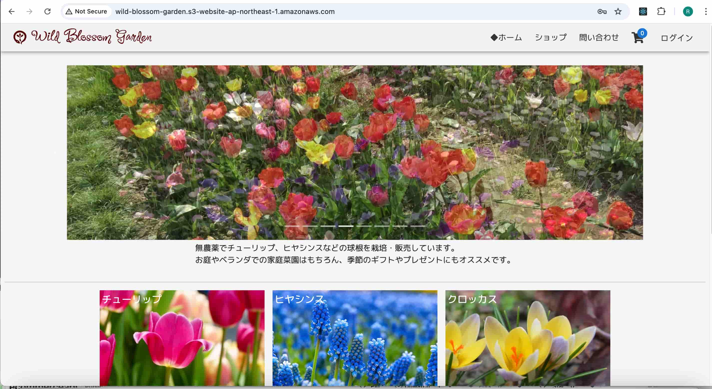
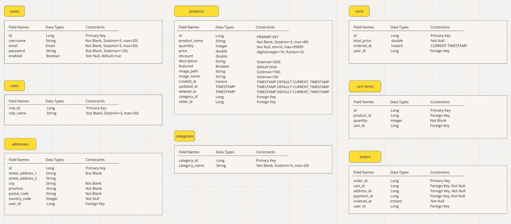

# ECサイトREST API

ECサイトのREST API。
Vite + Reactのフロントエンドプロジェクトで利用し、デプロイしたサイトを下記パスで公開している。 
[Wild Blossum Garden](http://wild-blossom-garden.s3-website-ap-northeast-1.amazonaws.com)

### 目次

1. 概要
2. 使用言語、フレームワーク
3. 主な機能
4. ER図
5. テスト
6. 参考資料

### 概要

チューリップ、ヒヤシンスなどの球根を販売するECサイトのREST API。
ユーザ、商品、カート情報、注文内容などのデータを取得、登録、更新、削除する。
ログイン機能にJWTとリフレッシュトークンを使用。カード決済処理はStripe APIを利用。

### 使用言語、フレームワーク、DB

Java(Spring Boot)
PostgreSQL

### 各機能のエンドポイント

#### ユーザアカウント登録、ログイン

| Nr  | 機能                      | API エンドポイント       | メソッド |
| --- | :----------------------- | :----------------- | :----- |
| 1   | アカウント登録              | /api/auth/signup   | post   |
| 2   | ログイン                  | /api/auth/signin   | post   |
| 3   | ログアウト                 | /api/auth/signout  | post   |
| 4   | ユーザ名取得               | /api/auth/username | get    |
| 5   | ユーザ情報取得              | /api/auth/user     | get    |

#### ユーザ住所

| Nr  | 機能                      | API エンドポイント       | メソッド |
| --- | :--------------------- | :------------------------- | :----- |
| 1   | 住所を登録（ユーザと紐づける）| /api/addresses             | post   |
| 2   | 住所を登録（ユーザと紐付けない。ユーザIDをnullとする。）| /api/addresses/anonym| post   |
| 3   | ログイン中ユーザの住所を取得| /api/user/addresses        | post   |
| 4   | 指定アドレスIDの住所を取得 | /api/addresses/{addressId} | get    |
| 5   | 指定アドレスIDの住所を更新 | /api/addresses/{addressId} | put    |
| 6   | 指定アドレスIDの住所を削除 | /api/addresses/{addressId} | delete |

- ユーザが住所を保存することを選択した場合、エンドポイントNr.1で処理し、保存しないと選択した場合
  Nr.2で処理する。
- Nr.6ではテーブル「Order」住所データが存在する場合は、住所データの物理削除を行わず、住所データのユーザIDをnullに更新する。

#### 商品カテゴリー登録、取得、更新、削除

| Nr  | 機能                      | API エンドポイント       | メソッド |
| --- | :--------------------- | :------------------------- | :----- |
| 1  | 全カテゴリーを取得        | /api/public/categories     | get    |
| 2  | カテゴリーを追加          | /api/admin/categories      | post    |
| 3  | カテゴリーを更新          | /api/categories/{categoryId} | get    |
| 4  | カテゴリーを削除          | /api/admin/categories/delete/{categoryId}| post   |

#### カート情報登録、取得、更新、削除

| Nr  | 機能                      | API エンドポイント       | メソッド |
| --- | :----------------------- | :----------------- | :----- |
| 1   | カートに商品を登録   | /api/cart/products/{productId}/quantity/{quantity} | post  |
| 2   | カートの商品個数を更新 | /api/cart/products/{productId}/quantity/{quantity} | put  |
| 3   | カートから商品を削除 | /api/carts/{cartId}/products/{productId} | delete |
| 4   | 全カート情報を取得 | /api/carts      | get    |
| 5   | ログイン中ユーザのカートを取得  | /api/carts/user/cart       | get    |

#### 商品情報登録、取得、更新、削除

| Nr  | 機能                      | API エンドポイント       | メソッド |
| --- | :--------------------- | :------------------------- | :----- |
| 1   | 全商品情報を取得          | /api/public/products     | get    |
| 2   | お勧め商品の取得          | /api/public/products/featured            | get    |
| 3   | 指定カテゴリーの商品を取得  | /api/public/categories/{categoryId}/products | get    |
| 4   | 商品を追加              | /api/admin/category/{categoryId}/product     | post   |
| 5   | 指定IDの商品データを更新 | /api/admin/products/{prodId}                 | put    |
| 6   | 指定IDの商品の削除日を設定 | /api/admin/products/delete/{prodId}          | put    |

#### レビュー情報登録、取得

| Nr  | 機能                      | API エンドポイント       | メソッド |
| --- | :------------------------ | :-------------------------- | :----- |post   |
| 1   | レビューを取得              | /api/public/reviews  | post   |
| 2   | 指定注文IDに紐づくレビューを登録| /api/review/{orderId}| post   |

#### 注文データ登録、取得およびclientSecretの取得
| Nr  | 機能                      | API エンドポイント       | メソッド |
| --- | :------------------------ | :-------------------------- | :----- |post   |
| 1   | 注文データを登録（登録済み住所を使用し、新規住所は登録なし）| /order       | post   |
| 2   | 注文データを登録（新規住所登録あり）| /order/newaddresses| post   |
| 3   | ログイン中ユーザの注文履歴データを取得| /order-history          | get   |
| 4   | Payment intent作成しclientSecretを返却する | /order/stripe-client-secret | post   |

### ER図

### テスト
全般的に動作確認済み。
単体テストJunit実施中、その後結合テストを実施予定。

### 参考資料

Udemyのコース「Java Spring Boot professional eCommerce project master class」を参考に作成。 
https://github.com/EmbarkXOfficial/spring-boot-course
