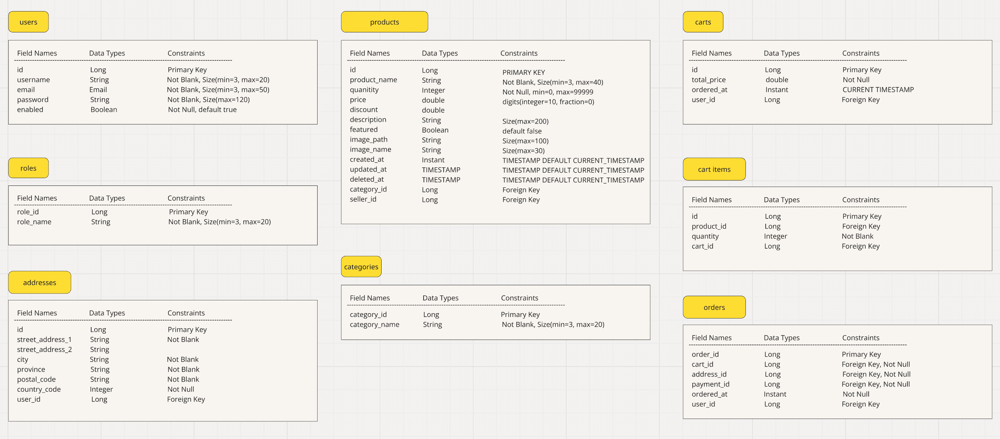

# Wild Blossom Garden - REST API for E-commerce Website 

Deployed website:
<a href="https://main.d1ke51gjkcvl1c.amplifyapp.com" target="_blank"> Wild Blossom Garden</a> 

<h2>Overview</h2>
Wild Blossom Garden is an imaginary online shop selling flower bulbs. Users can browse products, place items in their shopping carts, enter delivery and payment information and place orders. They can also view their order history and submit feedback about their purchase. This Rest API  handles requests from the frontend application and manages authentication and interactions with the database. 

The source code for the frontend application can be found <a href="https://github.com/rkyzk/vite-react/tree/dev-eng2" target="_blank">here.</a> 
.

<h2>Contents</h2>
<a href="#link1">1. Main Functions of the Website Wild Blossom Garden</a> 
<a href="#link2">2. Endpoints</a> 
<a href="#link3">3. ER Diagram</a> 
<a href="#link4">4. Use of Stripe API</a> 
<a href="#link5">5. Customization of Spring Security</a> 
<a href="#link6">6. Use of JWT and Refresh Tokens</a> 
<a href="#link7">7. Use of AWS S3 Bucket for Storing Images</a> 
<a href="#link8">8. Deploying on AWS</a> 
<a href="#link9">9. Credits</a> 

<h2 id="link1> Main Functions of the Website Wild Blossom Garden</h2>
- Browse Products
- View product details
- Search products by keywords, flower kinds and colors
- Sort by popularity or prices
- Manage user accounts
- Authenticate requests（JWT and refresh tokens are used.）
- Enter delivery and payment information
- Place orders
- View order history, submit feedback
- View customer review entries

<h2 id="link2">Endpoints</h2>
 
<h3>Products</h3>
| Nr  | Functions                | API Endpoints        | Methods |
|:--: | :----------------------- | :--------------------| :-----: |
| 1   | return product data      | /api/public/products | get   |
| 2   | return product detail    | /public/product/detail/{productId}| get   | 
| 3   | return product data of  a specific category| /public/categories/ {categoryId}/products| get   |            
 
<h3>Authentication</h3>
| Nr  | Functions                | API Endpoints        | Methods |
|:--: | :----------------------- | :--------------------| :-----: |
| 1   | create an account        | /api/auth/signup     | post    |
| 2   | log in                   | /api/auth/signin     | post    | 
| 3   | log out                  | /api/auth/signout    | post    | 
| 4   | get user's name          | /api/auth/username   | get     | 
| 5   | get user data            | /api/auth/user       | get     | 

 
<h3>Categories (flower kinds)</h3>
| Nr  | Functions                | API Endpoints        | Methods |
| --- | :----------------------- | :--------------------| :----- |
| 1   | get all categories       | /api/public/categories   | get   |
| 2   | add a category           | /api/admin/categories    | post   | 
| 3   | update a category        | /api/admin/categories/ {categoryId} | put   | 
| 4   | delete a category        | /api/admin/categories/ delete/{categoryId}| delete| 

<h3>Addresses</h3>
| Nr  | Functions                | API Endpoints        | Methods |
| --- | :----------------------- | :--------------------| :----- |
| 1   | get all addresses        | /api/addresses       | post   |
| 2   | add an address           | /api/addresses/anonym| post   | 
| 3   | get user address         | /api/user/addresses  | get    | 
| 4   | get address by id        | /api/addresses /{addressId} | get    |
| 5   | update address by id     | /api/addresses /{addressId} | put    |
| 6   | delete address by id     | /api/addresses /{addressId} | delete |

<h3>Carts</h3>
| Nr  | Functions                | API Endpoints        | Methods |
| --- | :----------------------- | :--------------------| :----- |
| 1   | update quantity of an item in cart | /cart/products/{productId}/ quantity/{quantity}| put   |
| 2   | delete a product from cart| /carts/{cartId}/products/ {productId}|delete | 
| 3   | get cart data of the current user| /carts/user/cart  | get    | 

<h3>Orders</h3>
| Nr  | Functions                | API Endpoints        | Methods |
| --- | :----------------------- | :--------------------| :----- |
| 1   | Place order (without registering new addresses)|/order| post   |
| 2   | Place order (register new addresses)|/order/newaddresses| post   |
| 3   | Get current user's order list|/order-history| get   |
| 4   |Create and return a payment intent using Stripe API|/order/stripe-client-secret|post|

<h3>Reviews</h3>
| Nr  | Functions                | API Endpoints        | Methods |
| --- | :----------------------- | :--------------------| :----- |
| 1   |Get list of review entries|/public/reviews       |get  |
| 2   |post a review about an order |/review/{orderId}     |post |

<h2>ER Diagram</h2>

<h2>Functions in more details</h2>
<h2>Use of Stripe API</h2>

<h2>Customization of Spring Security</h2>

<h2>Use of JWT and Refresh Tokens</h2>

<h2>Deploying on AWS</h2>

https://dev.to/wittedtech-by-harshit/mastering-aws-step-by-step-guide-to-deploying-a-full-stack-react-java-spring-boot-app-c8d

<h2>Credits</h2>

I learned methods to build ecommerce applications in the following course at Udemy: 
  "Java Spring Boot professional eCommerce project master class" 
  https://github.com/EmbarkXOfficial/spring-boot-course 
  I used many aspects learned from the course in this application.
  

I took code snippets from the following sites

- uploading images on AWS
https://qiita.com/tamorieeeen/items/051eb30f278e03f4ceff

Paragraphs are taken and modified from the following sites.

Descriptions on Product Detail Page

- Barcelona 
https://www.bostonseeds.com/products/barcelona-tulip-bulbs.html 
https://www.dutchbulbs.com/products/barcelona_triumph_tulip_?srsltid=AfmBOopZNTvKcsq57eW9GCPtbzS6ldv9nRGiM-98N32G0yxYHFpi5Xmo 

- Grape Hyacinths 
https://www.gardeningknowhow.com/ornamental/bulbs/grape-hyacinth/planting-and-care-of-grape-hyacinths.htm

- Advance crocus 
https://www.gardenia.net/plant/crocus-chrysanthus-advance

- Spring Green 
https://www.gardenia.net/plant/tulipa-spring-green-viridiflora-tulip

- Big Chief 
https://www.farmergracy.co.uk/products/tulip-big-chief-bulbs-uk 

- Labyrinth
https://www.longfield-gardens.com/products/dahlia-labyrinth?srsltid=AfmBOookZqK4dDSS1cf0GyCY9xqy2ZNSIUIa7fToB2gANSigJ24aeOQG

- White Nettie
https://www.courtercountryfarm.com/product-page/white-nettie-dahlia-tuber

- Anastasia
https://club.global.flowers/en/hyacinthus/14755-hyacinthus-orientalis-anastasia

- Growing tips 
https://www.floretflowers.com/resources/how-to-grow-tulips/ 

 

### 目次

1. 概要 
2. 使用言語、フレームワーク 
3. 各機能のエンドポイント 
4. 各機能概要 
5. Spring SecurityのカスタマイズとJWT・リフレッシュトークンの利用について 
6. カード決済処理におけるStripe APIの利用について 
7. CORS設定について 
8. ER図 
9. テスト 
10. 参考資料 

### 1. 概要

チューリップ、ヒヤシンスなどの球根を販売するECサイトのREST API。
ユーザ、商品、カート情報、注文内容などのデータを取得、登録、更新、削除する。
認証機能にJWTとリフレッシュトークンを使用。カード決済処理はStripe APIを利用。

### 2. 使用言語、フレームワーク、DB

Java(Spring Boot)
PostgreSQL

### 3. 各機能のエンドポイント

#### ユーザアカウント登録、ログイン、ログアウト

| Nr  | 機能                      | API エンドポイント       | メソッド |
| --- | :----------------------- | :----------------- | :----- |
| 1   | アカウント登録              | /api/auth/signup   | post   |
| 2   | ログイン                  | /api/auth/signin   | post   |
| 3   | ログアウト                 | /api/auth/signout  | post   |
| 4   | ユーザ名取得               | /api/auth/username | get    |
| 5   | ユーザ情報取得              | /api/auth/user     | get    |

#### 住所登録、取得、更新、削除

| Nr  | 機能                      | API エンドポイント       | メソッド |
| --- | :--------------------- | :------------------------- | :----- |
| 1   | 住所を登録（ユーザと紐づける）| /api/addresses             | post   |
| 2   | 住所を登録（ユーザと紐付けない。ユーザIDをnullとする。）| /api/addresses/anonym| post   |
| 3   | ログイン中ユーザの住所を取得| /api/user/addresses        | post   |
| 4   | 指定アドレスIDの住所を取得 | /api/addresses/{addressId} | get    |
| 5   | 指定アドレスIDの住所を更新 | /api/addresses/{addressId} | put    |
| 6   | 指定アドレスIDの住所を削除 | /api/addresses/{addressId} | delete |

- ユーザが住所を保存することを選択した場合、エンドポイントNr.1で処理し、保存しないと選択した場合
  Nr.2で処理する。（注文データと紐づけるためデータをDB登録する。）
- Nr.6ではテーブル「Order」住所データが存在する場合は、住所データの物理削除を行わず、住所データのユーザIDをnullに更新する。

#### 商品カテゴリー登録、取得、更新、削除

| Nr  | 機能                      | API エンドポイント       | メソッド |
| --- | :--------------------- | :------------------------- | :----- |
| 1  | 全カテゴリーを取得        | /api/public/categories     | get    |
| 2  | カテゴリーを追加          | /api/admin/categories      | post    |
| 3  | カテゴリーを更新          | /api/categories/{categoryId} | get    |
| 4  | カテゴリーを削除          | /api/admin/categories/delete/{categoryId}| delete   |

#### カート情報登録、取得、更新、削除

| Nr  | 機能                      | API エンドポイント       | メソッド |
| --- | :----------------------- | :----------------- | :----- |
| 1   | カートに商品を登録   | /api/cart/products/{productId}/quantity/{quantity} | post  |
| 2   | カートの商品個数を更新 | /api/cart/products/{productId}/quantity/{quantity} | put  |
| 3   | カートから商品を削除 | /api/carts/{cartId}/products/{productId} | delete |
| 4   | 全カート情報を取得 | /api/carts      | get    |
| 5   | ログイン中ユーザのカートを取得  | /api/carts/user/cart       | get    |

#### 商品情報登録、取得、更新、削除

| Nr  | 機能                      | API エンドポイント       | メソッド |
| --- | :--------------------- | :------------------------- | :----- |
| 1   | 全商品情報を取得          | /api/public/products     | get    |
| 2   | お勧め商品の取得          | /api/public/products/featured            | get    |
| 3   | 指定カテゴリーの商品を取得  | /api/public/categories/{categoryId}/products | get    |
| 4   | 商品を追加              | /api/admin/category/{categoryId}/product     | post   |
| 5   | 指定IDの商品データを更新 | /api/admin/products/{prodId}                 | put    |
| 6   | 指定IDの商品の削除日を設定 | /api/admin/products/delete/{prodId}          | put    |

#### 注文データ登録、取得およびclientSecretの取得
| Nr  | 機能                                        | API エンドポイント       | メソッド |
| --- | :----------------------------------- | :-------------------------- | :----- |
| 1   | 注文データを登録（登録済み住所を使用し、新規住所は登録なし）| /order       | post   |
| 2   | 注文データを登録（新規住所登録あり）           | /order/newaddresses| post   |
| 3   | ログイン中ユーザの注文履歴データを取得         | /order-history          | get   |
| 4   | Payment intent作成しclientSecretを返却する | /order/stripe-client-secret | post   |

#### レビュー情報登録、取得

| Nr  | 機能                      | API エンドポイント       | メソッド |
| --- | :------------------------ | :-------------------------- | :----- |
| 1   | レビューを取得              | /api/public/reviews  | post   |
| 2   | 指定注文IDに紐づくレビューを登録| /api/review/{orderId}| post   |

### 4. 各機能概要
TBD

### 5. Spring SecurityのカスタマイズとJWT・リフレッシュトークンの利用について
<a href="/documents/SpringSecurityのカスタマイズについて.md">Spring Securityのカスタマイズについて</a> 
<a href="/documents/JWTとリフレッシュトークンに係る仕様について.md">JWT・リフレッシュトークンに係る仕様について</a> 

### 6. カード決済処理におけるStripe APIの利用について
TBD
### 7. CORS設定について
ブラウザSame Origin PolicyCross Origin Resource Sharingとは他ドメインからそのドメインのリソースへのアクセスを許可することを、安全な形で制御するための仕組み。サーバ側でレスポンスのヘッダに値設定し、ブラウザがそのクライアントがリソースにアクセスすることが許可されているのかを判断する。

### 8. ER図

### 9. テスト
全般的に動作確認済み。
単体テストJunit実施中、その後結合テストを実施予定。

### 10. 参考資料
Udemyのコース「Java Spring Boot professional eCommerce project master class」を参考に作成。 
https://github.com/EmbarkXOfficial/spring-boot-course

Specification
https://qiita.com/pesysyon/items/2ae1cf04efece72af4b4

multiple keywords search
https://qiita.com/ibara1454/items/7d65d75a910dced33b50
